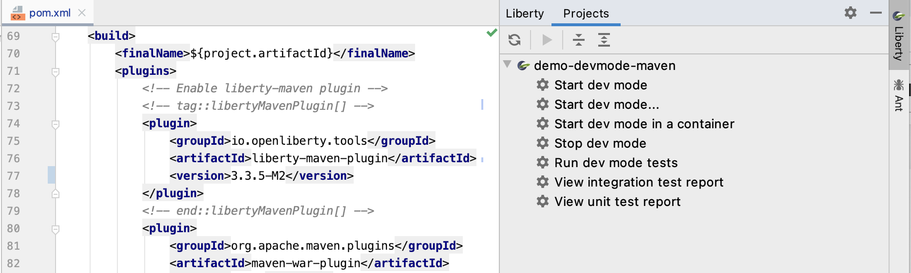

# Liberty Tools for IntelliJ

[plugin-repo]: https://plugins.jetbrains.com/plugin/14856-open-liberty-tools

[plugin-version-svg]: https://img.shields.io/jetbrains/plugin/v/14856-open-liberty-tools.svg

[](https://www.eclipse.org/legal/epl-2.0/)
[![JetBrains plugins][plugin-version-svg]][plugin-repo]


An [Open Liberty](https://openliberty.io/) extension for IntelliJ. The extension will detect your Liberty Maven or
Liberty Gradle project if it detects the `io.openliberty.tools:liberty-maven-plugin` in the `pom.xml` or
`io.openliberty.tools:liberty-gradle-plugin` in the `build.gradle`. Through the Liberty tool window, you can start,
stop, or interact with [Liberty dev mode](https://openliberty.io/docs/latest/development-mode.html) on all configured
[Liberty Maven](https://github.com/OpenLiberty/ci.maven/blob/master/docs/dev.md#dev)
and [Liberty Gradle](https://github.com/OpenLiberty/ci.gradle/blob/master/docs/libertyDev.md) projects in your
workspace.

Note that this extension requires the [Integrated Terminal plugin](https://plugins.jetbrains.com/plugin/13123-terminal)
to be enabled.



## Quick Start

- Install [_Liberty Tools_ from the IntelliJ Marketplace](https://plugins.jetbrains.com/plugin/14856-open-liberty-tools).
- Projects with the Liberty Maven Plugin or Liberty Gradle Plugin configured will appear in the Liberty tool window on
  the side bar. If not enabled by default, the tool window can be viewed by selecting **View > Tool Windows > Liberty**.
- Select a project in the Liberty tool window to view the available commands.

For more detailed instructions on your configuring your Liberty project and making use of the Liberty Tools
commands, check out [Getting Started](docs/GettingStarted.md).

## Features

- View supported `liberty-maven-plugin`(version `3.1` or higher) or `liberty-gradle-plugin`(version `3.0` or higher)
  projects in the workspace
- Start/Stop dev mode
- Start dev mode with custom parameters
- Run tests
- View unit and integration test reports

## Commands

| Command                      | Description                                                                                                                                                                                                                                                                                                                  |
| ---------------------------- | ---------------------------------------------------------------------------------------------------------------------------------------------------------------------------------------------------------------------------------------------------------------------------------------------------------------------------- |
| Start dev mode                        | Starts dev mode.                                                                                                                                                                                                                                                                                                             |
| Start dev mode…                     | Starts dev mode with custom parameters. Supported parameters can be found in the documentation for the [dev goal of the Liberty Maven Plugin](https://github.com/OpenLiberty/ci.maven/blob/master/docs/dev.md#additional-parameters) and the [libertyDev task of the Liberty Gradle Plugin](https://github.com/OpenLiberty/ci.gradle/blob/master/docs/libertyDev.md#command-line-parameters). |
| Start dev mode in a container                        | Starts dev mode with the server in a container. The `liberty-maven-plugin` must be version `3.3-M1` or higher. The `liberty-gradle-plugin` must be version `3.1-M1` or higher.
| Stop dev mode                         | Stops dev mode.                                                                                                                                                                                                                                                                                                              |
| Run dev mode tests                    | Runs the unit tests and integration tests that are configured for your project. This command requires dev mode to be already started.                                                                                                                                                                                        |
| View integration test report | Views the integration test report file if it exists at `/target/site/failsafe-report.html`.                                                                                                                                                                                                                                                                                      |
| View unit test report        | Views the unit test report file if it exists at `/target/site/surefire-report.html`.                                                                                                                                                                                                                                                                                             |

**Note:** Gradle projects only have a single `View test report` command. This will open the report if a file can be
found that matches the configured `tests.reports.html.destination` in the `build.gradle` file, otherwise it will open
the default `index.html` file.

## Contributing

Contributions to the Liberty Tools extension are welcome!

Our [CONTRIBUTING](CONTRIBUTING.md) document contains details for submitting pull requests.

Developing this extension using the
built-in [gradle-intellij-plugin](https://github.com/JetBrains/gradle-intellij-plugin/).

1. Clone this repository: `git clone git@github.com:OpenLiberty/open-liberty-tools-intellij.git`
2. Import this repository as a gradle project in IntelliJ IDEA
3. Run `./gradlew buildPlugin` to build a `.zip` that can be imported as gradle plugin or run the following Gradle task
   to build and run an IntelliJ instance:
   `./gradlew runIde`

### Localization

#### LibertyBundles.properties
Add localized strings in `src/main/resources/messages/LibertyBundles_{locale}.properties`. The default message file is `LibertyBundles.properties`.

#### Source code

1. Add new messages in `src/main/resources/messages/LibertyBunldes_{locale}.properties` file. If message has parameters, use curly brackets to enclose them: `{0}`, `{1}`...

2. Add the following import statement in your source code:

   ```java
   import io.openliberty.tools.intellij.util.LocalizedResourceUtil;
   ```

3. Call method `LocalizedResourceUtil.getMessage` to return localized message.

   Example without parameters:
   ```java
   String message = LocalizedResourceUtil.getMessage("my.message.key");
   ```
   Example with parameters:
   ```java
   String message = LocalizedResourceUtil.getMessage("my.message.key.with.params", param1, param2);
   ```

## Issues

Please report bugs, issues and feature requests by creating
a [GitHub issue](https://github.com/OpenLiberty/liberty-tools-intellij/issues)