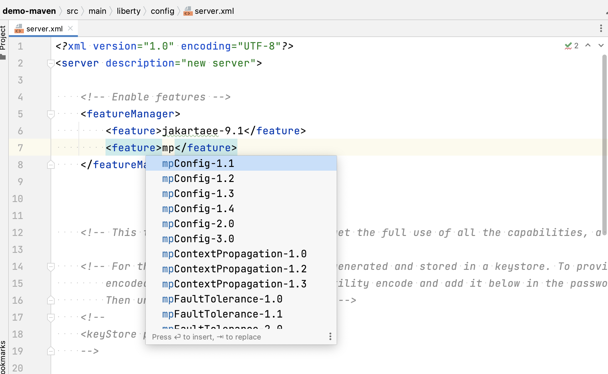

# Liberty Tools for IntelliJ IDEA

<!-- Make sure to also update the #Requirements section below, and in user-guide.md -->
> Note: Requires **IntelliJ IDEA 2023.1** or later, and **Java 17** or later. 
>
> This page provides an overview of Liberty Tools for IntelliJ IDEA.
> For minimum requirements information and detailed instructions on how to use Liberty Tools, check the [user-guide](docs/user-guide.md).

Liberty Tools for IntelliJ IDEA is an IntelliJ IDEA plugin for developing cloud-native Java applications with [Open Liberty](https://openliberty.io/) and [WebSphere Liberty](https://www.ibm.com/products/websphere-liberty). Iterate fast with Liberty dev mode, code with assistance for MicroProfile and Jakarta EE APIs, and easily edit Liberty configuration files.

---
- [Features](#features)
- [Quick start](#quick-start)
- [Actions](#actions)
- [Settings](#settings)
- [Requirements](#requirements)
- [Contributing](#contributing)
- [Issues](#issues)

Use Liberty Tools to run your Liberty Maven or Liberty Gradle projects through the Liberty tool window or the IntelliJ "Search Everywhere" window. You can start, stop, or interact with [Liberty dev mode](https://openliberty.io/docs/latest/development-mode.html) on all configured [Liberty Maven](https://github.com/OpenLiberty/ci.maven/blob/master/docs/dev.md#dev) and [Liberty Gradle](https://github.com/OpenLiberty/ci.gradle/blob/master/docs/libertyDev.md) projects in your workspace. Liberty Tools also helps you quickly and easily edit your application and configuration files by providing language support features for MicroProfile, Jakarta EE, and Liberty configuration and Java files.

For minimum requirements information and detailed instructions on how to use Liberty Tools, check out the [Liberty Tools for IntelliJ IDEA user guide](docs/user-guide.md) page.

## Features
- View Liberty projects in the Liberty tool window.
- Start/Stop dev mode.
- Start dev mode with custom parameters.
- Start dev mode in a container.
- Start dev mode with the debugger attached.
- Run tests.
- View test reports.
- Code with language assistance in the following configuration and application files:
    - `server.xml`, `server.env`, `bootstrap.properties` Liberty configuration files
    - Jakarta EE 9.x APIs in Java files
    - MicroProfile APIs in `microprofile-config.properties` and Java files

Feature completion in `server.xml` files helps you quickly edit your Liberty runtime configuration.

Hover in `bootstrap.properties` files provides more detailed descriptions.

Diagnostics in `server.env` files helps you quickly spot errors in your Liberty runtime configuration.

Helpful code snippets are provided in Java files for Jakarta EE APIs such as Jakarta RESTful Web Services.

Code completion for `microprofile-config.properties` files helps you easily set properties for MicroProfile APIs.

Editing assistance for configuration and application files is provided through the following language server projects, which this project consumes. For more information, see the documentation for these projects.

- Liberty configuration files: [Liberty Config Language Server](https://github.com/OpenLiberty/liberty-language-server#liberty-config-language-server)
- Jakarta EE APIs in Java files:  [Eclipse LSP4Jakarta](https://github.com/eclipse/lsp4jakarta#eclipse-lsp4jakarta), the Language Server for Jakarta EE.
- MicroProfile APIs in `microprofile-config.properties` and Java files: [Eclipse LSP4MP](https://github.com/eclipse/lsp4mp#eclipse-lsp4mp---language-server-for-microprofile), the Language Server for MicroProfile.

## Quick start

- Install [_Liberty Tools_ from the JetBrains Marketplace](https://plugins.jetbrains.com/plugin/14856-liberty-tools).
- Select a project in the Liberty tool window to view the available commands.

Projects with the Liberty Maven Plugin or Liberty Gradle Plugin configured will appear in the Liberty tool window on the sidebar. If the tool window is not enabled by default, you can view it by selecting **View > Tool Windows > Liberty**.

> Note: Make sure the **JAVA_HOME** system environment variable is set to define the JDK for running Liberty dev mode.

For minimum requirements information and detailed instructions on how to use the Liberty actions, check out the [Liberty Tools for IntelliJ IDEA user guide](docs/user-guide.md) page.

## Actions

The following actions are available when you select a project in the Liberty Tool Window.

| Action                                 | Description                                                                                                                                                                                                                                                                                                                                                                                                               |
|--------------------------------------|---------------------------------------------------------------------------------------------------------------------------------------------------------------------------------------------------------------------------------------------------------------------------------------------------------------------------------------------------------------------------------------------------------------------------|
| Start                                | Start dev mode.                                                                                                                                                                                                                                                                                                                                                                                                          |
| Start…                               | Open the **Run Configurations** dialog to customize and start dev mode. Supported parameters can be found in the documentation for the [dev goal of the Liberty Maven Plugin](https://github.com/OpenLiberty/ci.maven/blob/master/docs/dev.md#additional-parameters) and the [libertyDev task of the Liberty Gradle Plugin](https://github.com/OpenLiberty/ci.gradle/blob/master/docs/libertyDev.md#command-line-parameters). |
| Start in a container                 | Start dev mode with Liberty running in a container. The `liberty-maven-plugin` must be version `3.3-M1` or higher. The `liberty-gradle-plugin` must be version `3.1-M1` or higher.                                                                                                                                                                                                                                            
| Stop                                 | Stop dev mode. Liberty must be running in dev mode to use this command.                                                                                                                                                                                                                                                                                                                                                                                                          |
| Run tests                            | Run the unit tests and integration tests that are configured for your project. Liberty must be running in dev mode to use this command.                                                                                                                                                                                                                               |
| View integration test report (Maven) | View the integration test report file if it exists at `/target/site/failsafe-report.html`.                                                                                                                                                                                                                                                                                                                               |
| View unit test report (Maven)        | View the unit test report file if it exists at `/target/site/surefire-report.html`.                                                                                                                                                                                                                                                                                                                                      |
| View test report (Gradle)            | Open the test report file, if it exists at the `build/reports/tests/test/index.html` default location. This action command is available only to Gradle projects. Gradle projects have only a single action command for test result reporting.                                                                                                                                                                             |

## Requirements
<!-- Make sure to also update the note at the top of this file, and in user-guide.md -->
**IntelliJ IDEA 2023.1** or later, using **Java 17** or later.

For more details, check the [user guide](docs/user-guide.md#software-requirements).

## Contributing

See the [DEVELOPING](DEVELOPING.md) and [CONTRIBUTING](CONTRIBUTING.md) documents for more details.

## Issues

Please report bugs, issues and feature requests by creating
a [GitHub issue](https://github.com/OpenLiberty/liberty-tools-intellij/issues).
