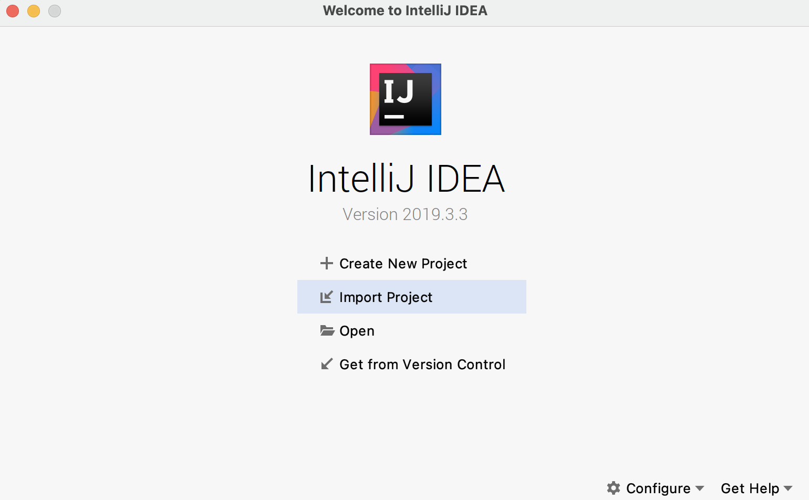
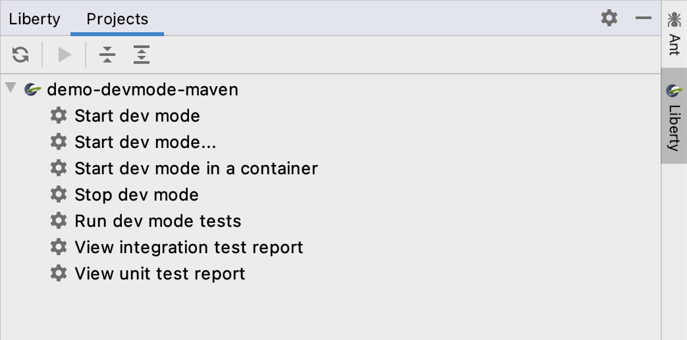
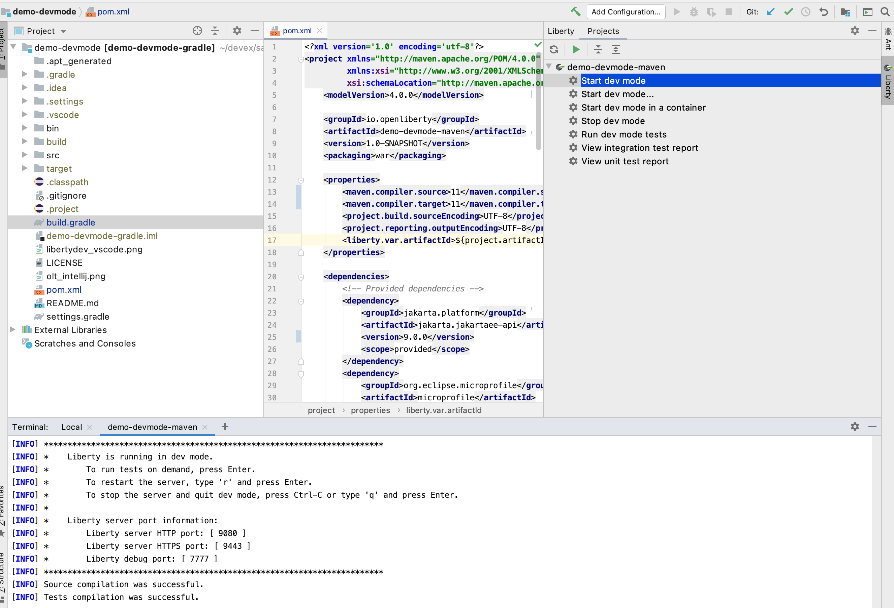
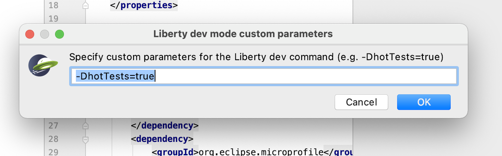
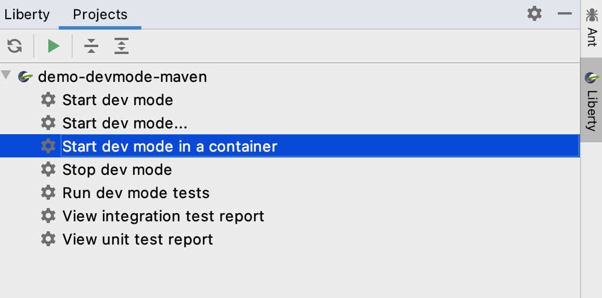
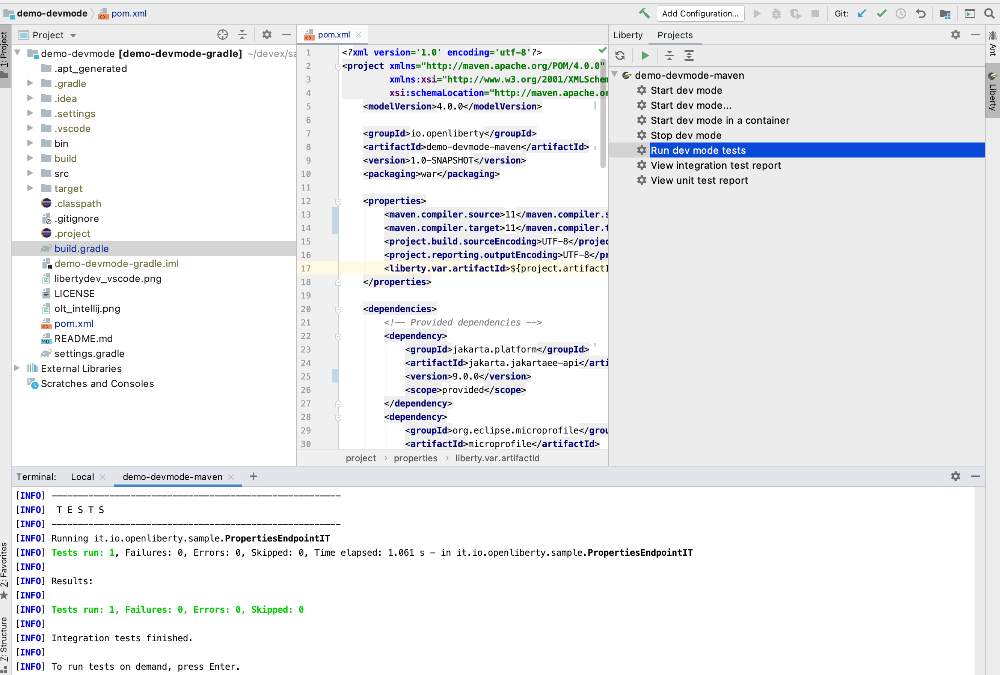
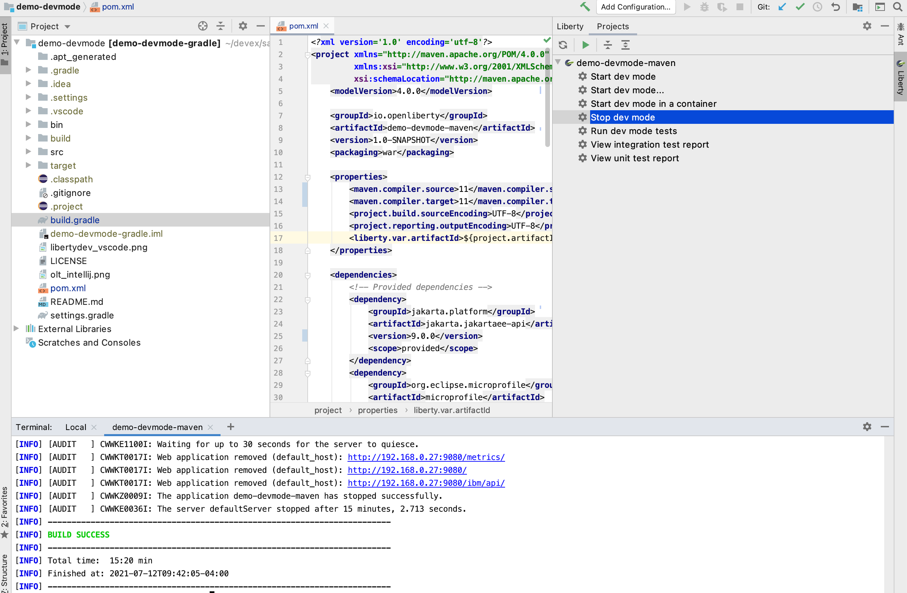

# Getting Started

Detailed instructions on how to import and configure your Liberty project to make use of the Liberty Tools
IntelliJ Plugin.

### Importing your Liberty project into IntelliJ

Startup IntelliJ IDEA and then choose "Import Project" from the main menu and select your Liberty project.



Ensure your project is configured with the Liberty Maven Plugin or Liberty Gradle Plugin to make use
of [dev mode](https://openliberty.io/docs/latest/development-mode.html).

For Maven projects, configure the Liberty Maven Plugin in your `pom.xml` file.

```xml

<plugin>
    <groupId>io.openliberty.tools</groupId>
    <artifactId>liberty-maven-plugin</artifactId>
    <version>3.3.4</version>
</plugin>
```

For Gradle projects, configure the Liberty Gradle Plugin in your `build.gradle` file.

```gradle
apply plugin: 'liberty'

buildscript {
    repositories {
        mavenCentral()
    }
    dependencies {
        classpath 'io.openliberty.tools:liberty-gradle-plugin:3.2'
    }
}
```

Ensure you can access the Liberty tool window in IntelliJ. This can be enabled by selecting **View > Tool Windows >
Liberty**. Your Liberty project should appear in the Liberty tool window. If it does not, ensure you have properly
configured the Liberty Maven Plugin or Liberty Gradle plugin and refresh the tool window.


### Running Liberty in dev mode

When you run Liberty in dev mode, you can rapidly code, deploy, test, and debug your application.

**Starting Liberty dev mode**

Select _Start dev mode_ via the Liberty tool window to start dev mode on the corresponding project. You will see dev
mode run in a new terminal window.



If you would like to start dev mode with custom parameters, such as `-DhotTests=true`, select _Start dev mode..._. A
popup window will appear prompting you for custom parameters. For a full list of supported parameters, check out
the [Liberty Maven dev goal parameters](https://github.com/OpenLiberty/ci.maven/blob/main/docs/dev.md#additional-parameters)
or
the [Liberty Gradle dev task parameters](https://github.com/OpenLiberty/ci.gradle/blob/main/docs/libertyDev.md#command-line-parameters)
.


If you would like to make use of dev mode for containers, select _Start dev mode in a container_. For more information on dev mode for containers, check out
the [Liberty Maven devc goal](https://github.com/OpenLiberty/ci.maven/blob/main/docs/dev.md#devc-container-mode) or
the [Liberty Gradle libertyDevc task](https://github.com/OpenLiberty/ci.gradle/blob/main/docs/libertyDev.md#libertydevc-task-container-mode)
.


**Running dev mode tests**

After dev mode has started on your project, you can select _Run dev mode tests_ from the Liberty tool window. Tests will
run in the corresponding terminal.


Test reports can be viewed by selecting the _View integration test report_ or _View unit test report_ actions from the
Liberty tool window. The test reports will open in the default browser.

**Stopping dev mode**

Select _Stop dev mode_ from the Liberty tool window to stop dev mode on the corresponding project.
