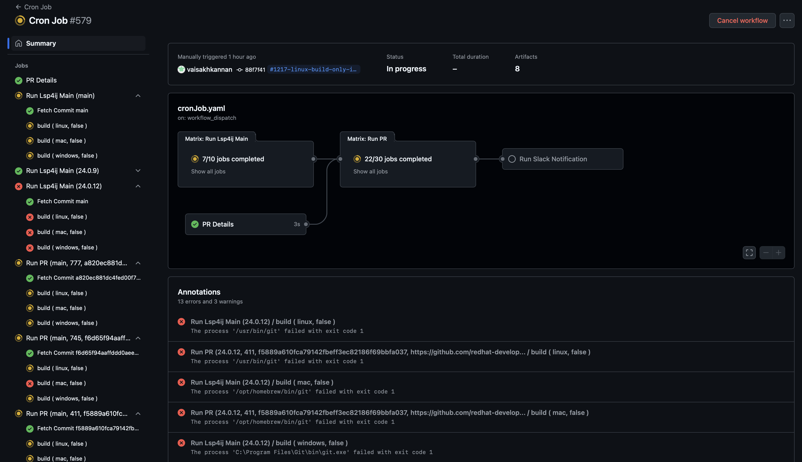
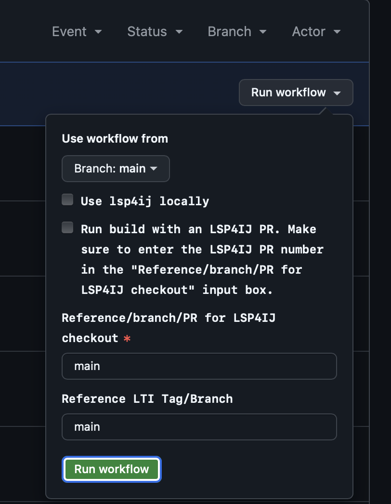

# LSP4IJ Continuous Integration

This guide offers a detailed explanation of the Continuous Integration (CI) setup for LSP4IJ integration, including automated integration and testing with Liberty Tools for IntelliJ (LTI). It ensures continuous feedback and provides early warnings when issues arise, allowing developers to address them promptly.

- [Workflow of normal build.yaml execution.](#workflow-of-normal-buildyaml-execution)
    - [Overview](#overview)
      - [Workflow Triggers](#workflow-triggers)
      - [Inputs](#inputs)
    - [Jobs](#jobs)
      - [Build Job](#build-job)
      - [Environment Variables](#environment-variables)
      - [Artifacts](#artifacts)
- [Cron Job builds](#cron-job-builds)
    - [Trigger](#trigger)
    - [Outputs](#outputs)
    - [Inputs](#inputs)
    - [Environment Variable](#environment-variable)
    - [Jobs](#jobs-1)
    - [Results from the Cron Job](#results-from-the-cron-job)
- [Testing against a Specific Version of LSP4IJ](#testing-against-a-specific-version-of-lsp4ij)
    - [Manually Trigger Workflow](#manually-trigger-workflow)
- [How to specify LTI tags or branches in CI-CD builds](#how-to-specify-lti-tags-or-branches-in-ci-cd-builds)
- [How to get Slack notifications for LSP4IJ PRs](#how-to-get-slack-notifications-for-lsp4ij-prs)
- [Sending build results to the Slack channel](#sending-build-results-to-the-slack-channel)


# Workflow of normal build.yaml execution.

## Overview

This GitHub Actions workflow automates the build process for the liberty-tools-intellij project, including optional integration with LSP4IJ and artifact management. It supports multiple operating systems and handles various scenarios based on input parameters.

### Workflow Triggers

The build.yaml workflow is triggered by the following events:

- Push: Triggered on any branch push.
- Pull Request: Triggered on pull requests to specific branches.
- Workflow Call: Allows triggering this workflow from other workflows. The cronJob workflow (cronJob.yaml file) triggers this workflow.
- Workflow Dispatch: Allows manual triggering of the workflow with customizable inputs.


  

To manually trigger the workflow, refer to the [Manually Trigger Workflow](#manually-trigger-workflow) section.

### Inputs

#### Workflow Call and Workflow Dispatch Inputs

- `refLsp4ij` (string, required): Merge commit SHA values or branch for checking out the lsp4ij repository. Default is main branch.
- `lsp4ijBranch` (string, required): PR number or branch name for artifact upload.
- `useLocalPlugin` (boolean, required): Whether to use a locally built LSP4IJ plugin or LSP4IJ from the marketplace. The default is false, which means use LSP4IJ from the marketplace.
- `refLTITag` (string, required): Reference LTI Tag/Branch. Default is main.

## Jobs

### Build Job

**Runs On**

The matrix strategy supports running on multiple operating systems:
- Linux (ubuntu-latest)
- macOS (macOS-latest)
- Windows (windows-latest)

**Steps**

1. Configure Pagefile (Windows Only) 
   - Uses al-cheb/configure-pagefile-action@v1.2 to configure the pagefile size.
2. Checkout Liberty-Tools-Intellij
   - Checks out the liberty-tools-intellij repository at the specified LTI Tag/Branch.
3. Install Required Integration Test Software
   - Runs a setup script to install necessary software for integration testing.
   
_**Steps 4-6 will execute only if useLocalPlugin == true**_

4. Checkout Lsp4ij (Conditional)
   - Checks out the lsp4ij repository . This step happens only when the cron job is running or when we want to manually run the workflow with LSP4IJ PRs.
5. Build Lsp4ij (Conditional)
    - Builds the LSP4IJ plugin
6. Unzip Lsp4ij File (Conditional)
   - Unzips the LSP4IJ build artifact
7. Build Liberty-Tools-Intellij
   - Builds the liberty-tools-intellij project, optionally using the locally built LSP4IJ plugin. Otherwise, it uses the LSP4IJ plugin from the marketplace.
8. Archive Artifacts (Linux Only)
   - Archives the build artifacts and stores them as a GitHub Actions artifact with a retention period of 7 days.
9. Run UI Integration Tests
   - Executes integration tests using a specified script.
10. Archive Test Logs and Reports (On Failure)
    - Archives test logs, videos and reports if the tests fail.
      By default, videos are only saved for failed tests. To save all the test videos, use the configuration specified [here](https://github.com/OpenLiberty/liberty-tools-intellij/blob/main/DEVELOPING.md#test-videos) 

### Environment Variables

- `USE_LOCAL_PLUGIN`: Set to the value of useLocalPlugin input or defaults to false.
- `REF_LSP4IJ`: Set to the value of refLsp4ij input.
- `LSP4IJ_BRANCH`: Set to the value of lsp4ijBranch input or defaults to 'default'.
- `REF_LTI_TAG`: Set to the value of refLTITag input.

### Artifacts

- Build Artifacts: Includes ZIP and JAR files from the liberty-tools-intellij build.

    For cron job builds : 

    For normal builds : 
    Here the LTI-default refers to the default branch that is checked out during standard builds, typically the branch from which the pull request was raised from or where a push was made. LSP4IJ-default indicates the version of LSP4IJ specified in the build.gradle file, which is retrieved from the marketplace.


- Test Logs and Reports: Logs, videos and reports from UI integration tests.


# Cron Job builds

This workflow automates the process of collecting open pull requests (PRs) in the LSP4IJ repository, running LTI builds against each PR, and notifying via Slack.It ensures that PRs which are not in draft state and are free from merge conflicts are built and tested, and it provides visibility into the build status for both the main branch and individual PRs.

This GitHub Actions workflow is designed to automate the following tasks:

1. **Fetch Pull Request Details:** Retrieves details of open PRs in the LSP4IJ repository, filtering out drafts and PRs with merge conflicts.

2. **Run Build Workflow:** Executes a build workflow for each valid PR and for the main branch of the LSP4IJ repository.

3. **Send Slack Notification:** Sends a notification to Slack with the build results.

### Trigger

- Scheduled Execution: The workflow runs at 9:30 AM UTC every Monday through Friday. This corresponds to 3:00 PM IST and 4:30 AM EST. 

- Manual Trigger: Can also be triggered manually via GitHub's workflow_dispatch event. 

  To manually trigger the `cronJob.yaml` workflow, go to the Actions tab in the OpenLiberty/liberty-tools-intellij repository. Select Cron Job Workflow under All workflows. You'll see a message about the `workflow_dispatch` event trigger, with a Run workflow button on the right. From there, you can select the branch to run the workflow.

### Outputs

- `pr_details`: JSON array of valid PR details.
- `is_empty`: Boolean indicating if there are no valid PRs.

### Inputs

- `refLTITag` - A matrix which can include values for LTI tags that specify the LTI versions and also the main branch, allowing the build to run against each version of LTI and the main branch of LTI.
- `refLsp4ij` -  SHA of the PR to be checked out for the build. Can be set to main to run against the LSP4IJ main branch.
- `useLocalPlugin` - Boolean for whether to use a locally built LSP4IJ plugin or the LSP4IJ plugin from the marketplace. Default is false, so it uses the marketplace version.
- `lsp4ijBranch` - Branch or version of LSP4IJ which was used in the build. It is displayed in the artifact name. It can be an LSP4IJ PR number or the value of ‘main’, which means the LSP4IJ ‘main’ branch. The default value is 'default', which means the LSP4IJ used in the build was the latest version in the marketplace.

Below are artifact names resulting from cron job builds. All of the builds ran with the LTI main branch. The first two artifacts come from builds using LSP4IJ PRs. The third artifact comes from a build using the LSP4IJ main branch.


### Environment Variable:
- `SLACK_WEBHOOK_URL`: URL of the Slack webhook for sending notifications.

### Jobs

**fetch_all_pull_request_shas:**

- Fetches PR details using the GitHub API.
- Extracts PR numbers and merge commit SHAs.
- Retries up to 5 times if mergeability is null, with a 5-second delay between attempts.
- Collects valid PR details and stores them in a JSON array.
- Checks mergeability status and collects PRs that are mergeable.
- Determines if there are no valid PRs and sets the is_empty output accordingly.

**call-build-workflow-for-each-merge-commit-sha:**

- Triggers a build workflow (.github/workflows/build.yaml) for each merge commit SHA from a valid PR that does not have merge conflicts.
- Depends on fetch_all_pull_request_shas. Runs only if is_empty is false.
- Sets the value of useLocalPlugin to true so that the build workflow uses a local build of LSP4IJ and not LSP4IJ from the marketplace.

**call-build-workflow-for-lsp4ij-main-branch:**

- Runs the build workflow for the LSP4IJ main branch.
- refLsp4ij: Set to “main” to run the build using the LSP4IJ main branch.

**call-build-workflow-slack-notification:**

- Runs on “ubuntu-latest”.
- Determines the final status based on the results of the build jobs.
- Sends a Slack notification with the workflow status and build results.
- Depends on both call-build-workflow-for-each-merge-commit-sha and call-build-workflow-for-lsp4ij-main-branch.
- Always runs regardless of previous job results.

## Results from the Cron Job

**Example of a Cron Job Output** - [Here](https://github.com/OpenLiberty/liberty-tools-intellij/actions/runs/11011078568The) 

Each build runs on Linux, Mac, and Windows.
There are four jobs in the build. The first job, **PR details**, outputs a list of PRs in the LSP4IJ repository and displays warnings for any PRs that are either drafts or have merge conflicts.


The next job, **Run Lsp4ij Main**, is the build which runs against the LSP4IJ main branch by checking out the LSP4IJ main branch. The job **Run PR** runs by checking out the merge commit SHAs of each PR listed in the job **PR details**. The LSP4IJ PR number against which the job is run is displayed in the bracket, followed by the merge commit SHA. After the first three jobs are completed, the **Run Slack Notification** job sends the build results as a Slack notification.



The Annotations section contains errors that show the details of the failed builds and also warnings that show PRs with merge conflicts.


# Testing against a Specific Version of LSP4IJ

In order to run the LTI build against a particular version of LSP4IJ (stable or nightly), the version can be set in the build.gradle file.


To run with a nightly version (For example: 0.4.0-20240813-173701 ), change the line `def lsp4ijVersion = '0.3.0'` to `def lsp4ijVersion = '0.4.0-20240813-173701@nightly'`. Make sure to add **@nightly** to the version number while testing with nightly versions. For stable versions, just specify the version number.
LSP4IJ nightly builds can be downloaded from the [JetBrains Marketplace](https://plugins.jetbrains.com/plugin/23257-lsp4ij/versions/nightly).

## Manually Trigger Workflow
To manually trigger the build.yaml workflow , navigate to the [Actions](https://github.com/OpenLiberty/liberty-tools-intellij/actions) tab in the OpenLiberty/liberty-tools-intellij repository. On the left side of the page, select Build Workflow under All workflows. You'll see a message stating, This workflow has a workflow_dispatch event trigger. To the right, there will be a Run workflow button. You can choose the branch from which to run the workflow.


If you want to use the version of lsp4ij specified in the build.gradle file, there's no need to check the box labeled Use lsp4ij locally. However, if you want to check out a different tag, merge commit SHA, or specific branch of lsp4ij, you can check the box and specify the branch in the provided field. Additionally, you can specify the tag or branch of liberty-tools-intellij to be used.


For example, if you want to trigger the Build Workflow from the `main` branch of the LTI repository and build against version `0.5.0` of LSP4IJ and the `main` branch of LTI, you would configure it as follows:


# How to specify LTI tags or branches in CI-CD builds

The **LTI Tags/Branches** must be specified in two locations within the `cronJob.yaml` file.
These are used in two jobs: `call-build-workflow-for-each-merge-commit-sha` and `call-build-workflow-for-lsp4ij-main-branch`.
There is a `tag` variable under the `matrix `that uses an array to store values. LTI tags or branches can be added to the tag array.


If an empty array ( `tag: ['']` ) is specified, the **LTI main branch** will be used.

If builds for both the **LTI main branch** and specific **LTI tags** or **branches** are required, the tag array should contain the **main** branch in addition to the **LTI tag/branch**. For example,

`tag: ['lsp4ij-market-0.0.2-integration', 'main']   `

If **main** is not specified, the build and tests will not run for **LTI main**.

Multiple tags and branches can be specified like so:

`tag: ['24.0.3', '24.0.6', 'lsp4ij-market-0.0.2-integration', 'main']`


# How to get Slack notifications for LSP4IJ PRs

This `pr-slack-notification.yaml` GitHub Actions workflow automates the process of fetching and notifying about `LSP4IJ` pull requests (PRs) using a cron job.

1. #### Trigger
    - The workflow is triggered manually via **workflow_dispatch** or on a **schedule** (cron) at `15:30 UTC` on weekdays (Monday to Friday).
2. #### Job Setup
    - Runs on an `ubuntu-latest` environment.
    - Sets up Environment Variables:
        - **REPO**: The repository name where the workflow runs.
        - **BRANCH**: The branch of the repository to be used for running the cron job and clearing the cache, which is currently the `main` branch.
        - **GH_TOKEN**: A GitHub token used for authenticating API requests.
        - **API_URL**: The URL to fetch pull requests from the [GitHub API](https://api.github.com/repos/redhat-developer/lsp4ij/pulls).
        - **SLACK_WEBHOOK_URL**: Specifying secret→  The webhook URL for sending notifications to Slack.
        - **WORKFLOW_BUILDER_WEBHOOK**: Specifying secret→ The webhook URL for triggering Slack Workflow Builder when at least one PR is present to display.
        - **NO_PR_WORKFLOW_BUILDER_WEBHOOK**: Specifying secret→ The webhook URL used when no pull requests are present
3. #### Steps
    - **Checkout Repository**: Checks out the code from the repository.
    - **Fetch Recent Cache**: Uses the GitHub CLI to list and select the most recent cache key or generates a new one if none exists.
    - **Restore Cache**: Attempts to restore cache from the selected cache key.
    - **Ensure Cache Directory Exists**: Checks if the cache directory exists and if the cache file is present.
    - **Fetch Open Pull Requests**: Fetches details of open PRs using the GitHub API and compares with cached PRs to identify new or updated PRs. Saves the new or updated PRs to environment variables for the retrieval of values in the remaining steps.
    - **Fetch Closed Pull Requests**: Retrieves closed PRs since the last run. Uses a timestamp to determine which PRs were closed since the last check.
    - **Send Slack Notification**: Sends a Slack notification with details of open/new/updated PRs and closed PRs, if there are any. Builds the notification payload based on the presence of open and closed PRs.
    - **Save Current Timestamp**: Saves the current timestamp to a file for future reference.
    - **Verify Cache Save**: Verifies and displays the saved cache content.
    - **Save Cache**: Saves the cache with a new key for future use.
    - **Cleanup Restored Cache Key**: Deletes the cache key used in the current run to manage cache size and prevent overflow.
    - **Slack Notification for Response Message**:  This job sends a Slack notification with a predefined message indicating a workflow action, selecting the appropriate webhook URL based on whether there are new or closed pull requests; if no PRs are found, it uses a specific webhook for such cases. Both webhook URLs are created using the Slack Webhook Builder. The main reason for using the Slack Webhook Builder is to allow changes to the Slack message text at the Slack level and not depend on the code in the repository.

4. #### Permissions
    - The workflow has write access to actions to manage cache keys. If additional permissions are needed, a Personal Access Token (PAT) might be required.

The workflow helps automate monitoring and notifying about PRs, ensuring updates are communicated efficiently while managing cache effectively.

> Note: The `secrets.GITHUB_TOKEN` is automatically provided by GitHub Actions for each workflow run. We don't need to manually create or manage this token.

```java
   permissions:
     actions: write
```

The lines above mean the workflow is granting `write` access to the actions scope of the `GITHUB_TOKEN`. This enables the workflow to be able to delete cache keys.
If the `write` permission does not enable the ability to delete the cache keys, then a repository admin will need to create a `Personal Access Token (PAT)` with write permissions, add it as a secret, and then specify the name in `GH_TOKEN`.


# Sending build results to the Slack channel

The job `call-build-workflow-slack-notification`, which is written at the end of the `cronJob.yaml` file, is responsible for sending build results as a Slack notification to the Slack channel `lsp4ij-monitoring`.

The job `call-build-workflow-slack-notification` runs after the jobs `call-build-workflow-for-lsp4ij-main-branch` and `call-build-workflow-for-each-merge-commit-sha` have completed. The notification provides information on whether the builds were successful or not.

#### How `call-build-workflow-slack-notification` works

* **Environment Variables** ( Prerequisite )
    - SLACK_WEBHOOK_URL: Secret containing the URL of the Slack webhook to send the notification to.
    - Slack App-Name →  **Alert-lsp4ij-PRs**
* **Determine Build Status**:
    - Retrieve the result of the **LSP4IJ main** branch build and the result of the **LSP4IJ PR** builds .
    - If all builds are successful, the build status will be `Success`. If any build fails, the build status will be `Failure`.
* **Send Slack Notification**:
    - The workflow uses curl to send a POST request to the `Slack webhook URL` with the build results.The message contains: the `workflow name`, the `branch` that triggered the workflow, a `link` to the workflow run on GitHub and the `final status` of the build.

By following these steps, this job ensures that a notification is sent to Slack about the status of the build process, indicating whether it succeeded or failed.

### This is how the slack message shows the build status

