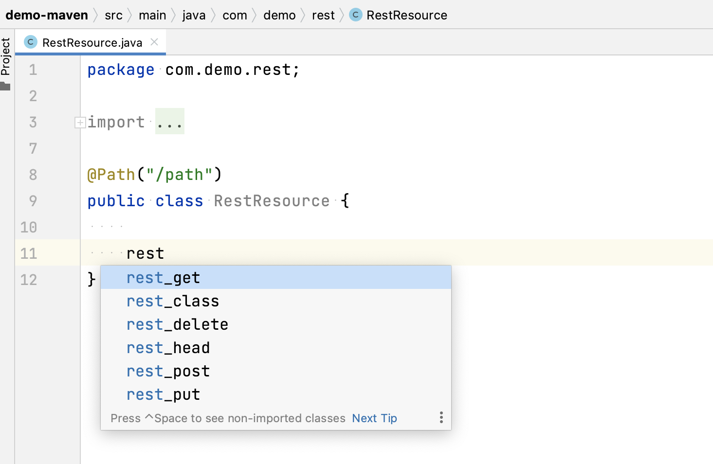
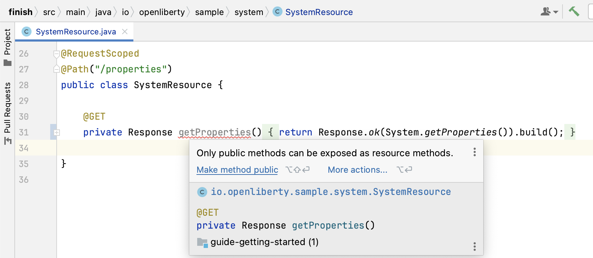

# Liberty Tools for IntelliJ IDEA User Guide

This guide provides detailed instructions on how to import and configure your Liberty project to use the Liberty Tools for IntelliJ IDEA plugin.
For information regarding known issues and limitations, refer to our [Common Issues](https://github.com/OpenLiberty/liberty-tools-intellij/wiki/Common-Issues) wiki page or our [Known Problems and Limitations](https://github.com/OpenLiberty/liberty-tools-intellij/wiki/Known-Problems-and-Limitations) wiki page.

- [Before you begin](#before-you-begin)
    - [Software requirements](#software-requirements)
    - [Application requirements](#application-requirements)
    - [Settings](#settings)
- [Manually install specific release of the LSP4IJ plugin from the Marketplace](#manually-install-specific-release-of-the-lsp4ij-plugin-from-the-marketplace)
- [Open the Liberty tool window](#open-the-liberty-tool-window)
- [Run your application on Liberty using dev mode](#run-your-application-on-liberty-using-dev-mode)
    - [Use the Liberty tool window](#use-the-liberty-tool-window)
    - [Use the "Search Everywhere" IntelliJ IDEA window](#use-the-search-everywhere-intellij-idea-window)
    - [Start your application in dev mode](#start-your-application-in-dev-mode)
    - [Start your application in dev mode with configuration](#start-your-application-in-dev-mode-with-configuration)
    - [Start your application in dev mode in a container](#start-your-application-in-dev-mode-in-a-container)
- [Run your application tests](#run-your-application-tests)
- [View your application test reports](#view-your-application-test-reports)
   - [Maven-built applications](#maven-built-applications)
   - [Gradle-built applications](#gradle-built-applications)
- [Stop your application](#stop-your-application)
- [Debug your application](#debug-your-application)
- [Create a Liberty Run/Debug Configuration](#create-a-liberty-rundebug-configuration)
- [Manually add your Liberty project to the tool window](#manually-add-your-liberty-project-to-the-tool-window)
- [Configure a Liberty server](#configure-a-liberty-server)
- [Develop with Jakarta EE and MicroProfile APIs](#develop-with-jakarta-ee-and-microprofile-apis)

## Before you begin
### Software requirements
<!-- Make sure to also update the main README.md note at its top, and its #Requirements section -->
- Version 24.0.12 requires **IntelliJ IDEA 2024.1.\***, **2024.2.\***, or **2024.3.\***. Liberty Tools for IntelliJ IDEA is compatible with the Community Edition of IntelliJ IDEA.
- **Java 17** or later. If you change the IntelliJ IDEA Boot Java Runtime through the **Change Boot Java Runtime for the IDE** preference, ensure that you are using Java 17 or later.
- [Liberty Tools for IntelliJ IDEA plugin](https://plugins.jetbrains.com/plugin/14856-liberty-tools/)

### Application requirements
- Define a Liberty `server.xml` configuration file in the `src/main/liberty/config` location.
- [Configure the Liberty Maven Plugin](https://github.com/OpenLiberty/ci.maven#configuration) or [configure the Liberty Gradle Plugin](https://github.com/OpenLiberty/ci.gradle#adding-the-plugin-to-the-build-script). We recommend using the most recent versions of the plugins as they include several important bug fixes.

    - [Liberty Maven Plugin latest release](https://github.com/OpenLiberty/ci.maven/releases/latest)

    - [Liberty Gradle Plugin latest release](https://github.com/OpenLiberty/ci.gradle/releases/latest)

### Settings
Liberty Tools for IntelliJ IDEA honors the following settings:

#### IntelliJ settings:
- The Maven home path that is set in the **Settings > Build, Execution, Deployment > Build Tools > Maven** window when you run Liberty dev mode on Maven projects.
- The Gradle Distribution that is set in the **Settings > Build, Execution, Deployment > Build Tools > Gradle** window when you run Liberty dev mode on Gradle projects.

#### Environment Variables:
- The **JAVA_HOME** system environment variable in the current terminal is used when you run Liberty dev mode in any project.

## Manually install specific release of the LSP4IJ plugin from the Marketplace

When installing the Liberty Tools for IntelliJ plugin, the latest version of LSP4IJ from the JetBrains marketplace will be installed by default.

If you prefer to use an older version of LSP4IJ (e.g., a specific version that was tested with the Liberty Tools release you are using), you can manually downgrade it by installing the desired version as a dependency from the [JetBrains marketplace](https://plugins.jetbrains.com/plugin/23257-lsp4ij/versions).

| Liberty Tools version | LSP4IJ version(s) tested   |
|-----------------------|----------------------------|
| 24.0.9                | 0.5.0, 0.6.0, 0.7.0, 0.8.1 |
| 24.0.12               | 0.8.1, 0.9.0               |

Steps to install an older version of LSP4IJ:
1. Go to the Plugins tab in the IDE Settings and uninstall the latest version.

2. Download the desired version from the provided link above; it will be saved as a zip file.

3. Reopen the IDE settings and navigate to the Plugins section.

4. Click the gear icon, then select "Install Plugin from Disk," and choose the downloaded zip file.
   

5. Confirm by clicking OK, then apply the changes. If prompted, restart your IDE.

## Open the Liberty tool window
Select **View > Tool Windows > Liberty**.

Projects that are already properly configured to run on Liberty and use Liberty dev mode are automatically added to the Liberty tool window when it opens. If your Liberty project does not show up in the Liberty tool window automatically and you have the Liberty Maven or Liberty Gradle plugin configured, check out [how to manually add your project to the Liberty tool window](#manually-add-your-liberty-project-to-the-tool-window).

If you add new projects or make changes, use the refresh icon in the Liberty tool window toolbar to refresh the tool window.

## Run your application on Liberty using dev mode

Three menu actions are available to start your Liberty application in dev mode through the Liberty tool window view or the "Search Everywhere" IntelliJ IDEA window: [Start](#start), [Start...](#start-with-configuration), or [Start in container](#start-in-container).

### Use the Liberty tool window

The Liberty tool window provides a context menu for Liberty projects. You can choose different actions from the menu to speed up application development.

### Use the Search Everywhere IntelliJ IDEA window

The Liberty Tools plugin provides a set of actions for the **Search Everywhere** IntelliJ IDEA window. You can access the **Search Everywhere** window either by pressing <kbd>Shift</kbd> twice, then selecting the **Actions** tab, or  by pressing <kbd>Ctrl</kbd> + <kbd>Shift</kbd> + <kbd>A</kbd> / <kbd>Cmd</kbd> + <kbd>Shift</kbd> + <kbd>A</kbd>. All Liberty Tools actions that are described in the following sections are also available from the **Search Everywhere** window.

### Start your application in dev mode

To start your application in dev mode, select the **Start** action for your application in the Liberty tool window.

A new terminal tab opens to the run the application in dev mode.

### Start your application in dev mode with configuration

To start your application in dev mode with custom configuration, select the **Start...** action for your application in the Liberty tool window. The action opens a Liberty Edit Configuration dialog. You can specify parameters for the [Liberty Maven dev goal](https://github.com/OpenLiberty/ci.maven/blob/main/docs/dev.md#additional-parameters) or [Liberty Gradle dev task](https://github.com/OpenLiberty/ci.gradle/blob/main/docs/libertyDev.md#command-line-parameters). You can also check the **Run in container** checkbox to start your application in dev mode in a container.

When you finish customizing the configuration, click **Run**.

A new terminal tab opens to run the application in dev mode.

The configuration that is shown in the **Edit Configuration** dialog is created and displayed automatically if a Run/Debug configuration is not already associated with the project. If a single configuration is already associated with the project, that configuration is displayed. If multiple configurations are already associated with the project, the highlighted/last run configuration is displayed.

### Start your application in dev mode in a container

To use dev mode for containers, select the **Start in container** action for your application in the Liberty tool window.

For more information on dev mode for containers, check out the [Liberty Maven devc goal](https://github.com/OpenLiberty/ci.maven/blob/main/docs/dev.md#devc-container-mode) or the [Liberty Gradle libertyDevc task](https://github.com/OpenLiberty/ci.gradle/blob/main/docs/libertyDev.md#libertydevc-task-container-mode).

## Run your application tests

After your application is running on Liberty using dev mode, you can easily run the tests provided by your application.

To run tests, select the **Run tests** action for your application in the Liberty tool window.

The tests are run in the corresponding terminal.

## View your application test reports

After you finish running your application tests, you can access the produced test reports. Test reports open in your external default browser.

### Maven-built applications

To view the integration test report for Maven-built applications, select the **View integration test report** action for your application in the Liberty tool window.

This action looks for the integration test report at two default locations: `target/reports/failsafe.html` and `target/site/failsafe-report.html`.

To view the unit test report for Maven-built applications, select the **View unit test report** action for your application in the Liberty tool window.

This action looks for the unit test report at two default locations: `target/reports/surefire.html` and `target/site/surefire-report.html`.

### Gradle-built applications

To view the test report for Gradle-built applications, select the **View test report** action for your application in the Liberty tool window.

This action looks for the unit test report at the `build/reports/tests/test/index.html` default location.

## Stop your application

To stop your application, select the **Stop** action for your application in the Liberty tool window.

## Debug your application

To debug your application, start dev mode with the debugger automatically attached to the Liberty server JVM that runs your application.

To start dev mode with the debugger attached, first create or select a **Liberty Run/Debug Configuration** through the **IntelliJ Run/Debug Configuration** menu. After you select the **Liberty Run/Debug Configuration**, select the **Debug** action next to the **Run/Debug Configuration** menu.

A new terminal tab opens to the run the application in dev mode and the debugger waits to attach.

The debug dialog pops up to confirm your debug configuration. Select **Debug**.

After the server starts, the IntelliJ IDEA debugger attaches and switches to the debug perspective. You can now set breakpoints and debug your code as usual.

## Create a Liberty Run/Debug Configuration

The Liberty Tools plugin contributes its own Run/Debug configuration. You can maintain several configurations to run Liberty with different parameters. Select the **Run -> Edit Configurations** menu to open the **Edit Run/Debug configurations** dialog. Click **+** and select Liberty from the menu. 

For more information, see [Run/debug configurations](https://www.jetbrains.com/help/idea/run-debug-configuration.html) in the Intellij IDEA documentation.

## Manually add your Liberty project to the tool window

In the event that your Liberty project is not automatically detected by the Liberty tool window, you can manually add your Liberty project to the Liberty tool window. To manually add your Liberty project to the Liberty tool window, select the **Liberty: Add project to the tool window** action in the **Search Everywhere** IntelliJ IDEA window.

You are prompted with a list of projects that are not already displayed in the Liberty tool window.

You can remove manually added Liberty projects from the Liberty tool window by selecting the **Liberty: Remove project from the tool window** action in the **Search Everywhere** IntelliJ IDEA window.

## Configure a Liberty server

Liberty configuration assistance provides code completion in Liberty `server.xml`, `server.env`, and `bootstrap.properties` files. 

1. Start the project in dev mode by using one of the previously described Liberty tool window start commands. Dev mode installs the Liberty features that are required for your application.
2. Open any of the supported Liberty configuration files. 
3. To use Liberty-specific code completion, press <kbd>Ctrl</kbd> + <kbd>Space</kbd> / <kbd>Cmd</kbd> + <kbd>Space</kbd> anywhere within the document. A drop-down list of completion suggestions appears.

Liberty configuration assistance is offered through the Liberty Config Language Server. For more information, see the [project documentation in GitHub](https://github.com/OpenLiberty/liberty-language-server#liberty-config-language-server).

## Develop with Jakarta EE and MicroProfile APIs

Liberty Tools editing assistance provides code completion, diagnostics, and quick-fixes in configuration and application files for Jakarta EE and MicroProfile APIs.

1. Open a Java or microprofile-config.properties file.
2. To use Jakarta EE-specific and MicroProfile-specific code completion, press <kbd>Ctrl</kbd> + <kbd>Space</kbd> / <kbd>Cmd</kbd> + <kbd>Space</kbd> anywhere within the document. A drop-down list of completion suggestions appears.

3. To use Jakarta EE-specific and MicroProfile-specific quick-fixes, hover over a Jakarta EE or MicroProfile diagnostic. A pop-up dialog appears that contains the diagnostic message and a quick-fix suggestion, if available. To see more quick-fix suggestions, click on the **More actions...** link.

Jakarta EE API configuration assistance is offered through Eclipse LSP4Jakarta, the Language Server for Jakarta EE. For more information, see the [project documentation in GitHub](https://github.com/eclipse/lsp4jakarta#eclipse-lsp4jakarta).

MicroProfile EE API configuration assistance is offered through Eclipse LSP4MP, the Language Server for MicroProfile. For more information, see the [project documentation in GitHub](https://github.com/eclipse/lsp4mp#eclipse-lsp4mp---language-server-for-microprofile).
