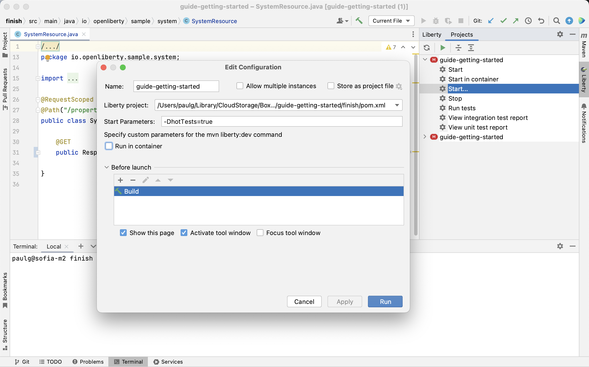

# Liberty Tools for IntelliJ IDEA User Guide

This guide provides detailed instructions on how to import and configure your Liberty project to use the Liberty Tools for IntelliJ IDEA plugin.

1. [Before you begin](#before-you-begin)
    - [Software requirements](#software-requirements)
    - [Application requirements](#application-requirements)
    - [Settings](#settings)
2. [Opening the Liberty tool window](#opening-the-liberty-tool-window)
3. [Running your application on Liberty using dev mode](#running-your-application-on-liberty-using-dev-mode)
    - [Using the Liberty tool window](#using-the-liberty-tool-window)
    - [Using the "Go to Action" IntelliJ IDEA menu](#using-the-go-to-action-intellij-idea-menu)
    - [Start](#start)
    - [Start with configuration](#start-with-configuration)
    - [Start in container](#start-in-container)
4. [Running your application's tests](#running-your-applications-tests)
5. [Viewing your application's test reports](#viewing-your-applications-test-reports)
6. [Stopping your application](#stopping-your-application)
7. [Debugging your application](#debugging-your-application)
8. [Manually adding your Liberty project to the tool window](#manually-adding-your-liberty-project-to-the-tool-window)
9. [Configuring a Liberty server](#configuring-a-liberty-server)
10. [Developing with Jakarta EE and MicroProfile APIs](#developing-with-jakarta-ee-and-microprofile-apis)

## Before you begin
### Software requirements
- **IntelliJ IDEA**: Starting with the Liberty Tools for IntelliJ IDEA 0.0.8 release, IntelliJ IDEA version 2022.2 is required. Liberty Tools for IntelliJ IDEA is compatible with the Community Edition of IntelliJ IDEA.
- Java 17 is required by Liberty Tools for IntelliJ IDEA and bundled with IntelliJ IDEA version 2022.2+. If you have changed the IntelliJ IDEA Boot Java Runtime through the "Change Boot Java Runtime for the IDE" preference, ensure that you are using Java 17.
- [Liberty Tools for IntelliJ IDEA plugin](https://plugins.jetbrains.com/plugin/14856-liberty-tools/)

### Application requirements
- Define a Liberty `server.xml` configuration file in the `src/main/liberty/config` location.
- Configure the [Liberty Maven Plugin](https://github.com/OpenLiberty/ci.maven#configuration) or [Liberty Gradle Plugin](https://github.com/OpenLiberty/ci.gradle#adding-the-plugin-to-the-build-script). We recommend using recent versions of the plugins as they include several important bug fixes.

  The following versions are recommended at minimum:

    - Liberty Maven Plugin -> 3.7.1

    - Liberty Gradle Plugin -> 3.5.1

### Settings

Liberty Tools for IntelliJ IDEA honours  the following external settings:
- Maven home path set in the **Preferences > Build, Execution, Deployment > Build Tools > Maven** window when running Liberty dev mode on Maven projects.
- Gradle JVM set in the **Preferences > Build, Execution, Deployment > Build Tools > Gradle** window when running Liberty dev mode on Gradle projects.

## Open the Liberty tool window
Select **View > Tool Windows > Liberty**.

Projects that are already properly configured to run on Liberty and use Liberty dev mode are automatically added to the Liberty tool window when it opens.

If you add new projects or make changes, use the refresh icon in the Liberty tool window toolbar to refresh the tool window.

_insert screenshot of refresh button highlighted_

## Run your application on Liberty using dev mode

Three menu actions are available to start your Liberty application in dev mode through the Liberty tool window view or the "Go to Action" IntelliJ IDEA menu: [Start](#start), [Start...](#start-with-configuration), or [Start in container](#start-in-container).

### Use the Liberty tool window

The Liberty tool window provides a context menu for Liberty projects. You can choose different actions from the menu to speed up application development.

### Use the "Go to Action" IntelliJ IDEA menu

The Liberty Tools plugin provides a set of actions for the "Go to Action" IntelliJ IDEA menu. You can access the **Go to Action** IntelliJ IDEA menu either by pressing **Shift** twice, then selecting the **Actions** tab, or  by pressing **Ctl/Cmd** + **Shift** + **A**.

### Start your application in dev mode

To start your application in dev mode, either right-click on the application in the Liberty tool window and select the **Start** action, or select the **Liberty: Start** action in the **Go to Action** IntelliJ IDEA menu.

A new terminal tab will open to the run the application in dev mode.

### Start your application in dev mode with configuration

To start your application in dev mode with custom configuration, either right-click on the application in the Liberty tool window and select the **Start...** action, or select the **Liberty: Start...** action in the **Go to Action** IntelliJ IDEA menu. The action opens a Liberty Run/Debug Configuration dialog. You can specify parameters for the [Liberty Maven dev goal](https://github.com/OpenLiberty/ci.maven/blob/main/docs/dev.md#additional-parameters) or [Liberty Gradle dev task](https://github.com/OpenLiberty/ci.gradle/blob/main/docs/libertyDev.md#command-line-parameters).

When you finish customizing the configuration, click **Run**.

A new terminal tab will open to run the application in dev mode.

Note that the configuration shown in the Run/Debug Configurations dialog is created and displayed automatically if one is not already associated with the project. If a single configuration is already associated with the project, that configuration is displayed. If multiple configurations are already associated with the project, the highlighted/last run configuration is displayed.

### Start your application in dev mode in a container

To use dev mode for containers, you can either right-click on the application in the Liberty tool window and select the **Start in container** action, or select the **Liberty: Start in container** action in the **Go to Action** IntelliJ IDEA menu.

For more information on dev mode for containers, check out the [Liberty Maven devc goal](https://github.com/OpenLiberty/ci.maven/blob/main/docs/dev.md#devc-container-mode) or the [Liberty Gradle libertyDevc task](https://github.com/OpenLiberty/ci.gradle/blob/main/docs/libertyDev.md#libertydevc-task-container-mode).
## Running your application's tests

After your application is running on Liberty using dev mode, you can easily run the tests provided by your application.

To run tests, you can either right-click on the application in the Liberty tool window and select the **Run tests** action, or select the **Liberty: Run tests** action in the **Go to Action** IntelliJ IDEA menu.

The tests are run in the corresponding terminal.

## View your application's test reports

After you finish running your application's tests, you can access the produced test reports. Test reports will open in your external default browser.

### Maven-built applications

To view the integration test report for Maven-built applications, either right-click on the application in the Liberty tool window and select the **View integration test report** action or select the **Liberty: View integration test report** action in the **Go to Action** IntelliJ IDEA menu.

This action looks for the integration test report at the `/target/site/failsafe-report.html` default location.

To view the unit test report for Maven-built applications, either right-click on the application in the Liberty tool window and select the **View unit test report** action or select the **Liberty: View unit test report** action in the **Go to Action** IntelliJ IDEA menu.

This action looks for the unit test report at the `/target/site/surefire-report.html` default location.

### Gradle-built application

To view the test report for Gradle-built applications, either right-click on the application in the Liberty tool window and select the **View test report** action or select the **Liberty: View test report** action in the **Go to Action** IntelliJ IDEA menu.

This action looks for the unit test report at the `build/reports/tests/test/index.html` default location.

## Stop your application

To stop your application, either right-click on the application in the Liberty tool window and select the **Stop** action or select the **Liberty: Stop** action in the **Go to Action** IntelliJ IDEA menu.

## Debug your application

To debug your application, start dev mode with the debugger automatically attached to the Liberty server JVM that runs your application.

To start dev mode with the debugger attached, first create or select a **Liberty Run/Debug Configuration** through the **IntelliJ Run/Debug Configuration** menu. After you select the **Liberty Run/Debug Configuration**, select the **Debug** action next to the **Run/Debug Configuration** menu.

A new terminal tab opens to the run the application in dev mode and the debugger waits to attach.

The debug dialog pops up to confirm your Debug Configuration. Select **Debug**.

Once the server starts, the IntelliJ IDEA debugger attaches and switches to the debug perspective. You can now set breakpoints and debug your code as usual.

## Manually add your Liberty project to the tool window

To manually add your Liberty project to the Liberty tool window, select the **Liberty: Add project** to the tool window` action in the **Go to Action** IntelliJ IDEA menu. 

You are prompted with a list of projects that are not already displayed in the Liberty tool window.

You can remove manually added Liberty projects from the Liberty tool window by selecting the **Liberty: Remove project from the tool window** action in the **Go to Action** IntelliJ IDEA menu.

## Configure a Liberty server

Liberty configuration assistance provides code completion in Liberty `server.xml, 'server.env`, and `bootstrap.properties` files. 

1. Start the project in dev mode, using one of the previously described Liberty tool window start commands. Dev mode installs the Liberty features that are required for your application.
2. Open any of the supported Liberty configuration files. 
3. To use Liberty-specific code completion, press **Ctl/Cmd** + **Space** anywhere within the document. A drop-down list of completion suggestions appears.

Liberty configuration assistance is offered through the Liberty Config Language Server. For more information, see the [project documentation in GitHub](https://github.com/OpenLiberty/liberty-language-server#liberty-config-language-server).
## Develop with Jakarta EE and MicroProfile APIs

Editing assistance for configuration and application files for Jakarta EE and MicroProfile APIs is provided through the following language server projects, which this project consumes. For more information, see the documentation for these projects: 
- Jakarta EE APIs in Java files:  [Eclipse LSP4Jakarta](https://github.com/eclipse/lsp4jakarta#eclipse-lsp4jakarta), the Language Server for Jakarta EE.
- MicroProfile APIs in microprofile-config.properties and Java files: [Eclipse LSP4MP](https://github.com/eclipse/lsp4mp#eclipse-lsp4mp---language-server-for-microprofile), the Language Server for MicroProfile.

Open a Java or microprofile-config.properties file. Proceed to use Jakarta EE and MicroProfile specific editing support: completion by typing "Ctl/Cmd + Space" at a given point within the document.

